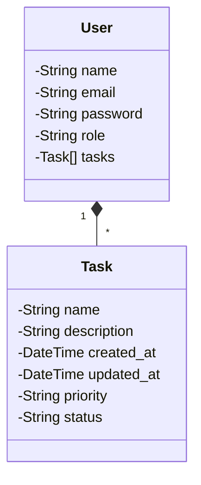

# tasklist-rest-api
Repositório com API Restful de uma tasklist feita em java com SpringBoot, com intuitos de estudo

## Diagrama de classes

```mermaid
classDiagram
    class User {
        -String name
        -String email
        -String password
        -String role
        -Task[] tasks
    }

    class Task {
        -String name
        -String description
        -DateTime created_at
        -DateTime updated_at
        -String priority
        -String status
    }

    User "1" *-- "*" Task
```
